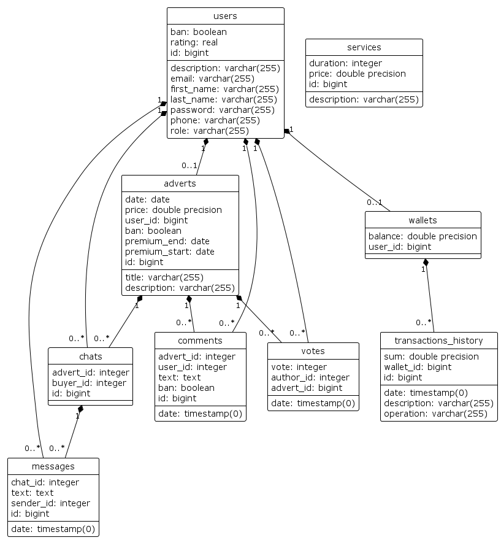

# final
RESTful проект системы размещения частных объявлений
# Содержание
- **Структура проекта**
- **Схема БД**
- **Сборка, запуск и остановка проекта**
- **Использованные технологии**
## Структура проекта
После запуска апи будет доступно по адресу http://localhost:8080/swagger-ui/index.html#/

Доступный функционал:

**Объявления** - Методы работы с объявлениями
- **GET /api/adverts/{advertId}** - запрос объявления по id
- **PUT /api/adverts/{advertId}** - изменения объявления по id. Требует авторизации, 
позволяет для пользователей менять свои объявления, для администраторов любые.
- **DELETE /api/adverts/{advertId}** - удаление объявления по id. Требует авторизации,
    позволяет для пользователей удалять свои объявления, для администраторов любые.
- **PUT /api/adverts/{advertId}/ban** - установление статуса ban = true для 
объявления по id. Только для администраторов.
- **POST /api/adverts** - создание нового объявления. Требует авторизации.
- **POST /api/adverts/{advertId}/vote** - создание оценки на объявление по id. Требует авторизации.
- **POST /api/adverts/{advertId}/services/{serviceId}** - покупка услуги подписки с выбором тарифа по id на объявление по id. Требует авторизации и достаточного баланса кошелька.
- **POST /api/adverts/{advertId}/buy** - покупка объявления по id. Требует авторизации и достаточного баланса кошелька.
- **GET /api/adverts/services** - запрос на список всех тарифов подписки для объявлений. Требует авторизации.
- **GET /api/adverts/find** - поиск объявлений по заголовку с фильтрами и сортировкой.

**Комментарии** - Методы работы с комментариями
- **PUT /api/comments/{commentId}/ban** - установление статуса ban = true для
    комментария по id. Только для администраторов.
- **GET /api/adverts/{advertId}/comments** - запрос списка всех комментариев объявления по id. Требует авторизации.
- **POST /api/adverts/{advertId}/comments** - создание комментария для объявления по id. Требует авторизации.

**Пользователи** - Методы работы с пользователями
- **GET /api/users/{userId}** - запрос пользователя по id. Требует авторизации.
- **PUT /api/users/{userId}** - изменения пользователя по id. Требует авторизации.
- **DELETE /api/users/{userId}** - удаление пользователя по id. Требует авторизации,
    позволяет для пользователей удаление своего пользователя, для администраторов любых.
- **PUT /api/users/{userId}/ban** - установление статуса ban = true для
  пользователя по id. Только для администраторов.
- **GET /api/users** - запрос на список всех пользователей. Требует авторизации.

**Кошелёк** - Методы работы с кошельком
- **GET /api/wallet** - запрос кошелька пользователя. Требует авторизации.
- **POST /api/wallet** - создание кошелька пользователя. Требует авторизации.
- **POST /api/wallet/add** - добавление суммы денег на баланс кошелька пользователя по id. Требует авторизации.
- **GET /api/wallet/history** - запрос истории транзакций кошелька пользователя. Требует авторизации.

**Авторизация** - Методы авторизации и регистрации
- **POST /api/auth/signup** - создание нового пользователя.
- **POST /api/auth/login** - авторизация существующего пользователя.

**Чат** - Методы работы с сообщениями
- **GET /api/chats/{chatId}/messages** - запрос существующих сообщений из чата где авторизованный пользователь участник.
- **POST /api/chats/{chatId}/messages** - отправка сообщения в чат где авторизованный пользователь участник.
- **POST /api/chats** - запрос списка существующих чатов, где авторизованный пользователь участник.
- **GET /api/chats/{advertId}** - для покупателей запрос чата с продавцом по id объявления, 
- для продавцов запрос чата по id покупателя и по id своего объявления. Если чат не существует, 
- будет создан новый чат.

## Схема БД

## Сборка, запуск и остановка проекта
Для запуска необходимо иметь java 17 и докер
Для сборки приложения нужно запустить скрипт `init.bat`. 
Для запуска приложения используется скрипт `start.bat`. 
И для остановки приложения используется скрипт `end.bat`

## Использованные технологии
* Java 17
* Maven
* Spring Boot 3.0.6 (web, data-jpa, security, aop, validator)
* JWT
* Lombok
* MapStruct 1.5.5
* OpenApi 3

В качестве базы данных был использован PostgreSQL 15.